## Abstract
目前主流的目标检测算法可以预测目标置信度、定位框和类别，且为已知的目标类别。但在商品检测和识别等细粒度目标识别任务中，一旦新增目标类别，需重新训练模型，使得算法应用的灵活性大大降低。针对这一问题，本文提出了端到端的细粒度目标检测和特征提取网络FOF，基于YOLOV7网络改进的无类别目标检测器，为了使网络能够检测并识别出训练集目标类别以外的物体，去除了网络Head中的类别输出，用128维的特征向量代替，同时为了提高特征的分类能力，使用ArcFace损失函数进行训练。由于缺少类别输出，提出了改进的NMS算法NMS-FS，用于区分同类和异类的预测定位框。推理时输出目标的定位框和特征向量，计算特征向量之间的余弦相似度进行匹配，从而完成目标检测和识别。实验结果表明FOF在MS COCO、PASCAL VOC2012、SmartUVM 以及大规模、细粒度的零售产品结账数据集上均取得了较高的准确率。此外，该方法在识别新类别时表现出较低的EER率，达到了检测和识别新类别时不需要重新训练模型的目的。
## Method
###  Inference framework  
本本文所提出的细粒度目标检测和特征提取方法框架如图所示，通过一个端到端的FOF网络实现了细粒度图像的目标定位和特征提取。首先，将单品图送入训练好的FOF网络中，得到每类物体对应的特征向量，将其作为特征向量目标集，用于推理时的特征匹配。推理时，通过FOF网络得到待检测图像中所有目标的定位框和特征向量，将特征向量与目标集中的特征向量匹配，找出最相似的特征向量，其标签信息即为识别结果。

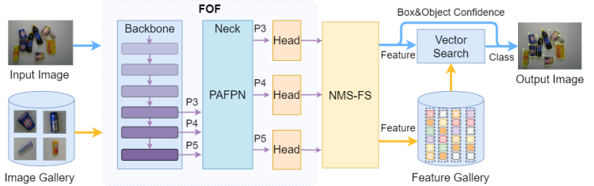

### FOF
FOF是基于YOLOV7改进的，旨在提出一种能够定位细粒度目标的同时能够提取其特征向量，解决细粒度目标定位和分类任务网络无法识别新增类别的问题以及常用两阶段算法中先定位每个目标再分别提取特征的效率问题，因此为了能在目标检测任务中提取特征向量，本文修改了YOLOV7的Head部分。将原来的每个特征层的预测向量 $W*H*anchor*(4+1+num\_class)$ 
修改为 
$W*H*anchor*(4+1+feature\_length)$
，由原来的定位框、目标置信度和类别输出更改为定位框、目标置信度和目标特征向量，通过每个目标的特征向量与目标集的特征匹配完成目标识别，目标集中的特征向量可以任意扩增，不受数量限制。
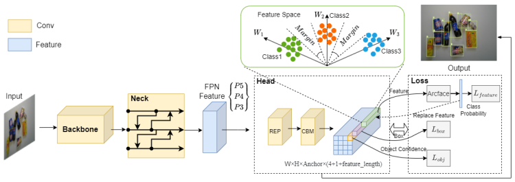

FOF的损失函数包含预测框损失、目标置信度损失和特征损失三部分，标签匹配策略结合了YOLOV5的标签匹配策略和SimOTA标签匹配策略。
预测框损失使用CIoU Loss, CIoU同时考虑了两个矩形框的重叠面积、中心点距离以及两个矩形框的宽高比，计算公式如下
$L_{box}=L_{CIoU}=1-IoU+\frac{\rho^2(p,p^{gt})}{c^2}+\alpha V$
其中其中$\alpha$是权重函数,而$V$用来度量长宽比的相似性，定义为
$V=\frac{4}{\pi^2}(arctan\frac{w^{gt}}{h^{gt}}-arctan\frac{w}{h})^2,\alpha=
\begin{cases}
0& \text{if IoU < 0.5}\\
\frac{V}{(1-IoU)+V}& \text{if IoU} \geq 0.5
\end{cases}$
目标置信度损失使用BCE Loss
$L_{obj}=\frac{1}{N}\sum_{i=1}^{N}{-ylog(p)-(1-y)log(1-p)}$
为了实现对细粒度目标分类且获得其特征向量，我们引入了Additive Angular Margin Loss (ArcFace)，来提高类间可分性同时加强类内紧凑性，特征损失公式如下
$L_{feature}=-\frac{1}{N}\sum_{i=1}^{N}{log(\frac{e^{s(cos(\theta_{y_i}+m))}}{e^{s(cos(\theta_{y_i}+m))}+\sum_{j=1,j\neq y_i}^{n}{e^{s(cos\theta_j)}}})}$
SimOTA中为了自动分配给每个Anchor更容易学习的GT，通过计算每个样本与GT之间的cost，将cost值较小几个样本作为该GT的正样本，其中cost的计算公式如下
$c_{ij}=L_{cls}(P_j^{cls},G_i^{cls})+\sigma L_{box}(P_j^{box},G_i^{box})$
其中，$i,j$分别表示第$i$个GT和第$j$个Anchor,$L_{cls}$表示每个样本与每个GT之间的分类损失，$L_{box}$表示每个样本与每个GT之间的预测框的回归损失，$P,G$分别表示预测值和真实值，$\alpha$为可调节的超参数。
我们在此基础上，删除了$L_{cls}$，同时，为了缓解缺少类别代价带来的问题，使用Arcface将训练得到的每个类别中心特征与样本中的特征向量计算得到各个类别的概率，再去计算交叉熵损失
因此，我们的cost计算公式如下
$\hat{c_{ij}} =L_{feature}(P_j^{feature},G_i^{cls})+\sigma L_{box}(P_j^{box},G_i^{box})$
最终，总损失函数定义如下：
$L_{total}=\alpha L_{box}+\lambda L_{obj}+\mu L_{feature}$

###  Feature vector to category probability  
由于YOLO-FOF网络输出没有类别信息，在进行验证时就无法统计mAP等指标，因此，我们在验证阶段修改的网络的输出，将特征向量重新转变为类别概率输出，如图3中所示。具体做法是将归一化后的特征向量和每个类别中心权重相乘得到，计算得到特征向量与真实类别之间的角度，再在上添加惩罚，计算，最后经softmax函数得到类别概率。但是，YOLO-FOF输出的是每个网格上的三个anchor预测值，大部分并不会对应一个真实类别，因此无法转化。而在计算损失时，标签匹配策略会挑选出正样本。验证时，只需将这些正样本的特征向量转化为类别分数，并与真实标签相比计算指标，网络输出的其他预测框的类别概率均设置为0即可。
###  Improved NMS algorithm, NMS-FS  
一般的目标检测算法，模型最后都会输出大量的预测框。例如，在YOLOv7中，如果输入640×640尺寸的图像，那么网络将输出(80×80+40×40+20×20)×3 = 25200个目标，虽然可以通过目标置信度阈值过滤掉大量的非目标框，但是仍然存在着大量预测框定位到同一目标的情况，非极大值抑制模块NMS的作用就是将这些重叠的预测框去除，如图4所示。传统的NMS算法会对每个类别分别应用单类NMS，这样可以避免不同类别的重叠框被误删，然而FOF的输出只有坐标、目标置信度和特征向量，并没有类别信息，因此如果使用传统的NMS，只能将所有的预测框视为同一类别再进行NMS，此时就可能造成不同类别的预测框被误删。
虽然，FOF并没有输出每个物体的类别信息，但是其输出的目标特征向量可以作为判别依据。如果和特征向量库中的特征向量进行对比找出每个预测框对应的类别，再进行NMS，显然是不可取的，这会消耗大量的计算资源，影响整体推理性能。本文提出了针对FOF网络输出的目标定位框和特征向量改进的NMS算法-NMS-FS，先将所有预测目标作一类，进行一次NMS运算，随后再对预测目标框判断IoU是否大于阈值，对大于IoU阈值的目标框通过计算两个目标的特征相似度来判断是否为同一类别，只有IoU和特征相似度都大于阈值的预测目标框才会被删除，仅需极少的特征匹配次数，大大提升了NMS性能，伪代码如下。
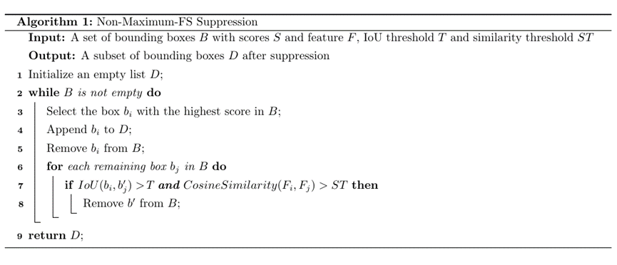
## Experiments
###  Comparison with baseline  
由于FOF网络输出的特征向量在训练网络中可以转化为类别概率，在训练和验证阶段仍可以计算mAP来验证模型性能。从表中可以看出，在COCO数据集中，FOF相比于YOLOV7，mAP(0.5)提升了2.1%，mAP(0.5:0.95)提升了0.2%。在PASCAL VOC2012、SmartUVM 和 RPC 数据集，FOF的mAP (0.5) 分别增加 5.0%、0.1% 和 0.1%，而mAP(0.5:0.95)部分则有所下降。但是在参数量和计算量上，FOF并不会随着类别数量的增加而增加，当类别数大于特征向量长度时，优势更为明显，在200类的RPC数据集中，参数量减少了1.1%，计算量减少了1.3%，推理时间减少了5.4%。
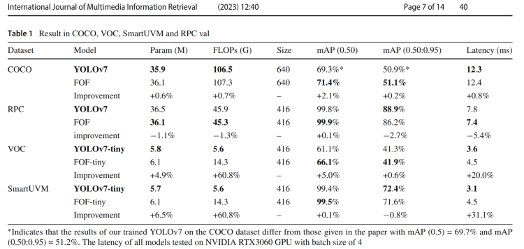
###  Feature matching experiments on RPC dataset  
本文选择在RPC数据集的验证集上进行匹配实验，为了去除网络定位不准确给特征提取带来的问题，只考虑IoU大于0.9的结果，即计算每个真实框与检测框的IoU，将IoU最大且大于0.9的检测框判定为该真实框的检测结果，确保提取到正确的物体特征。得到所有图像中物体的特征向量后，随机生成了100w个类内对和1000w个类间对，通过计算这1100w个特征对之间的余弦相似度，绘制相似度直方图，如图所示，可以明显看出清晰的类内和类间分布曲线边界，类间相似度分数分布在0-0.4之间，类内相似度分数分布在0.9-1之间，在0.4-0.9之间的相似度分数极少，证明了FOF具有极好的目标识别性能。ROC曲线如图4所示，从图中可以看到，特征匹配的等错误率EER为0.033%，在错误接受率 FAR 为 0.0001 水平下的真实阳性率（TAR@FAR=0.01%）为99.959%，再次验证了该网络的优越性能。同时，通过ROC曲线得到了最佳阈值，用于NMS-FS模块中的类别判定，也可作为模型推理时和特征向量目标集进行匹配识别的依据。
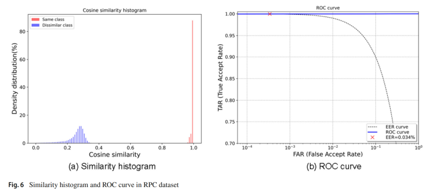
另外，我们t-SNE将128维的特征向量转化为2 维，随机选取了20类进行类别分布可视化，从图中可以看出
不同类别的特征很好地分开，而同类内聚性较好，具有很好的聚类效果。
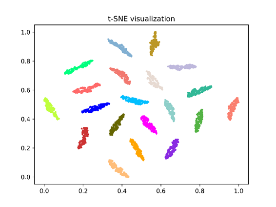

###  Feature matching experiments on New Category dataset  
为了检验模型对新增类别的识别效果，采集了RPC训练集中从未出现的10类商品，每类各100张共1000张图片，且都是饮料这一大类的细分子类，如图11所示：
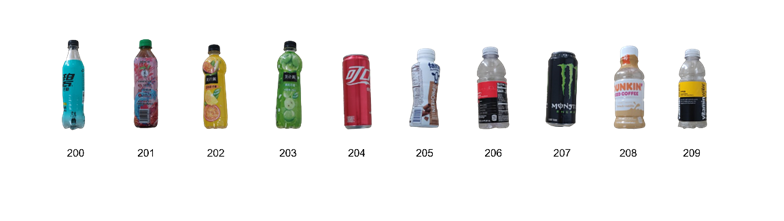
将采集的类别加入RPC验证集的图像中进行检测，若特征向量库中还未加入新采集的类别的特征向量时，检测结果为未知，当将新增类别的特征向量加入到特征向量库中后，再次检测，即可识别出新增类别，如图12所示，达到了不需要重新训练模型即可添加新的类别的目的。
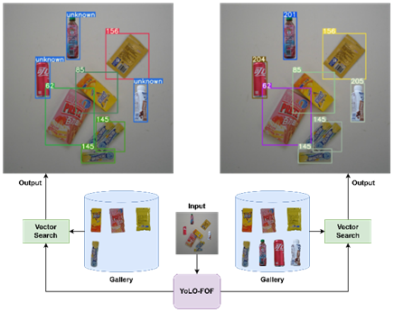
为了定量分析模型对新增类别的识别性能，在新增数据集上随机生成了42644个类内匹配对和89725个类间匹配对。由于训练集的限制，仅有200个类别，而使用ArcFace训练开集分类任务，通常需要成千上万种类别让模型能够将不同类别之间区分开，且有足够的区域供给新的类别中心，在PP-ShiTu中结合了7种不同的数据集用于训练，共185K个类别。受此限制，在200类的RPC数据集上训练的模型在新增数据集上所提取的特征表现不如原始数据集上的结果。相似度分数直方图和ROC曲线如图13、14所示，相似度分数分布在0.4-0.8之间存在交叉，类内和类间之间的边界没有图8的界限明显，等错误率EER为1.766%，在错误接受率 FAR 为 0.0001 水平下的真实阳性率（TAR@FAR=0.01%）为84.473%，从t-SNE可视化图中可以看到，个别类别出现了离群导致EER升高，但是也初步证明了该方法的可行性。
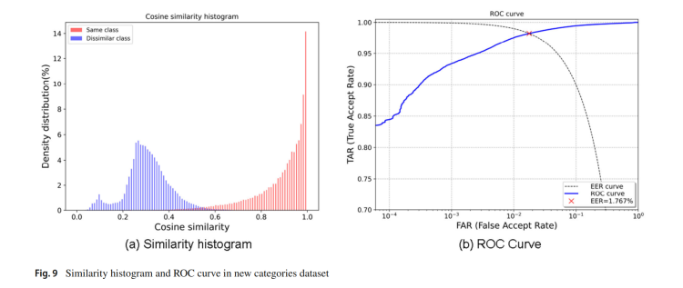
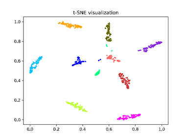
###  Comparison with two-step network  
我们的模型受PP-Shitu算法的启发，将两步算法整合到一起，实现了一个端到端的细粒度目标检测和特征提取网络。相比于两步算法，我们最大的优势在推理时间上，在不增加模型参数量和计算量，同时不损失检测精度甚至能够提高检测精度的情况下，显著缩短了推理时间，尤其在图像中包含多个目标的情况下。为了验证这一说法，我们复现了PP-Shitu中使用的PP-PicoDet目标检测网络和PP-LCNet特征提取网络，在相同环境下，计算了各个模型的推理时间。检测网络的图像大小设置为416*416，特征提取的图片大小设置为224*224，从表中可以看出，FOF-tiny的推理时间为10.7ms，明显小于PP-Shitu的PP-PicoDet和PP-LCNet推理时间总和（10.9ms+7.8ms=18.7ms），也超过了标准FOF模型的推理时间（16.3ms）。这仅是在一张图像中仅有一个目标的情况下的结果。若图像中存在10个目标，则PP-Shitu的推理时间为10.9ms+7.8ms*10=88.9ms，远远大于我们的网络。
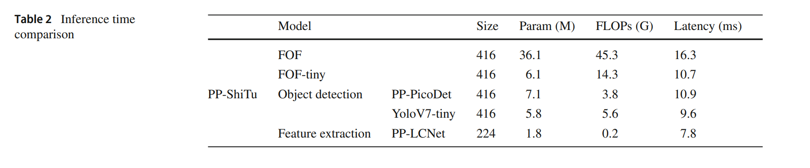
###  NMS-FS effect  
NMS-FS是一种改进的非极大值抑制方法，在面对同时进行目标检测和特征提取这种没有类别输出而是特征向量的任务时，它能够有效地解决复杂重叠的商品结算图中误删的问题。例如下图中，当IoU阈值都设置为0.3，(a)使用单类NMS，(b)使用NMS-FS，(b)中箭头所指的21，就能够不被剔除，从而提高召回率。
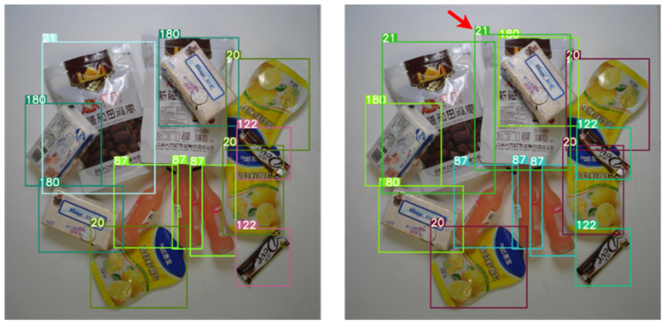
###  Parameter sensitivity analysis and comparative experiments for loss function 
为了研究ArcFace损失函数中参数s和m的不同取值对模型性能的影响，我们进行了一系列实验，使用了RPC数据集。具体实验设置如下：当s=30时，我们分别尝试了m的取值为0.1、0.3和0.5，以及当s=60时，我们同样尝试了m的取值为0.1、0.3和0.5。为了加快训练，以下所有实验都是在FOF-tiny模型下测试，我们将详细的实验结果总结在Table 3中。
从表中可以观察到以下关键发现：当s相同时，较小的m值导致模型在RPC数据集上的mAP(0.5)更高，同时，匹配实验的EER指标也更低。此外，对于在RPC数据集上训练的模型而言，s取值为60时，性能优于s取值为30时。我们还在新增数据集上测试了这些模型，结果表明，在新增数据集上也得到了相同的趋势。
我们进一步探究了s=60、30和m=0.1、0.3、0.5时，RPC数据集和新增数据集上的余弦相似度直方图。从图中可以观察到，m值越大，类内距离越小，余弦相似度越大且分布更集中，类间距离越大，余弦相似度越小且分布也更集中。然而，在新增数据集上，这一趋势并不如预期明显。我们认为这可能是因为训练数据集的类别数量较少，导致模型的泛化性能受到限制。

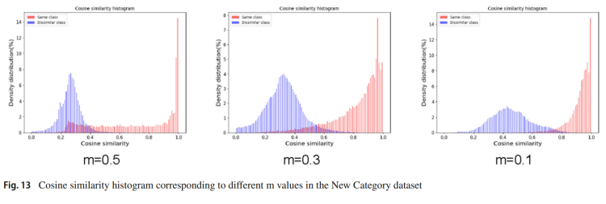
综合Table 3的结果，我们得出结论，m的取值对模型性能具有显著影响，但需要根据不同数据集的特性进行调整。这一发现对于选择合适的超参数值以优化模型在特定任务上的性能具有重要指导意义。
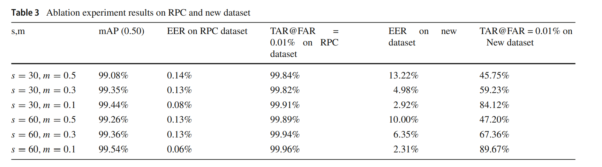
本文采用的ArcFace损失函数属于度量学习中的损失函数之一，与Triplet Loss、Center Loss、L-Softmax Loss、SphereFace、CosFace等相同，旨在增大类间距离、缩小类内距离。关于这些损失函数的对比实验，已经有大量研究进行了对比研究，为了验证我们使用的ArcFace损失函数和这些损失函数在我们的架构下依旧有效且与前人所做实验结果一致，我们选择了SphereFace、CosFace与ArcFace进行对比，实验结果表明，在VOC数据集中，ArcFace的性能优于CosFace，并且优于SphereFace。这一结果与ArcFace论文中的对比实验结果一致，充分证明了在我们的框架下，ArcFace损失函数的有效性。详细实验结果见表4。
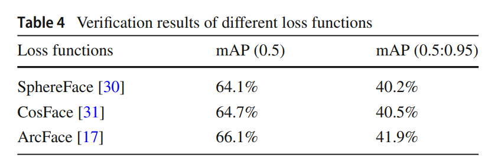
##  Conclusion   
本文提出了一种端到端的细粒度目标检测和特征提取模型FOF。该模型通过对YOLOV7网络的Head部分进行修改，使其能够在输出坐标的同时输出128维的特征向量。同时，该模型还引入了开集分类任务中常用的ArcFace损失函数，使其在具备目标检测能力的同时，也具备了开集分类的能力。这样即可达到不需要重新训练模型就能达到检测和识别目标的目的，从而解决了细粒度目标定位加特征提取任务中的效率问题。另外，针对FOF模型的输出，本文还提出了一种改进的非极大值抑制算法NMS-FS，用于解决异类目标被误删的问题。实验结果表明，FOF在MS COCO、PASCAL VOC2012、SmartUVM 以及大规模、细粒度的零售产品结账数据集上均取得了较高的准确率，验证了该网络可同时完成目标检测和识别的有效性和准确性。此外，该方法在识别新类别时表现出较低的EER率，验证了其对于新增目标识别的可行性和有效性，达到了检测和识别新类别时不需要重新训练模型的目的。本文使用一个网络结构，实现了端到端的目标检测和特征向量的提取，在准确定位目标的同时，既能识别多个任意新增类别目标，又可以大大提高多类别多目标场景中的目标识别速度，具有较高的应用价值。
